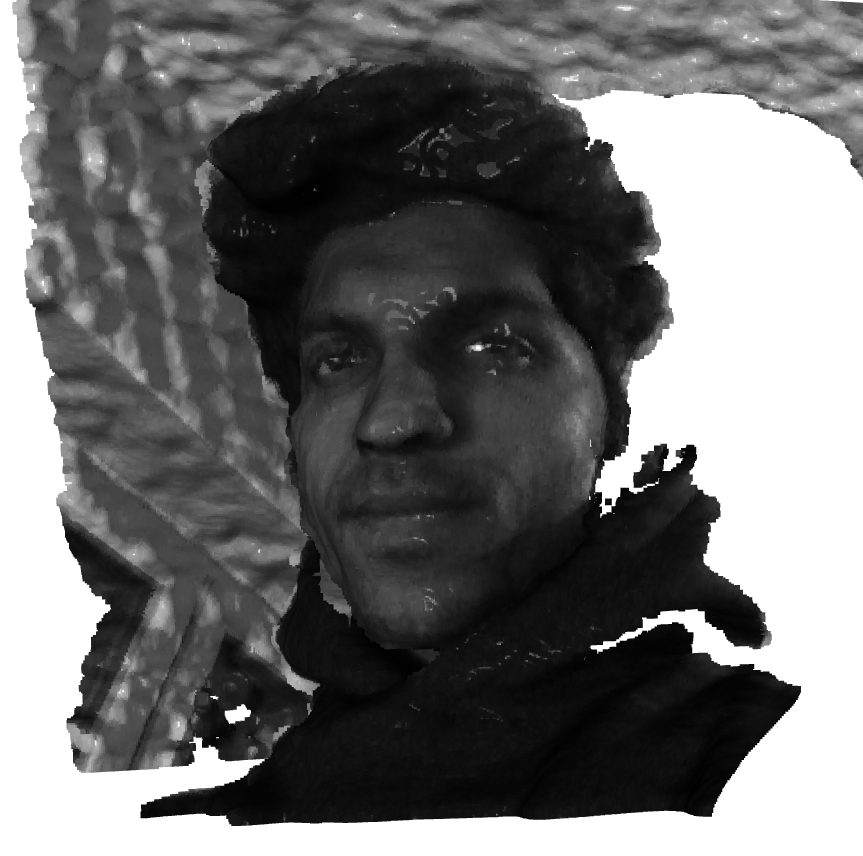
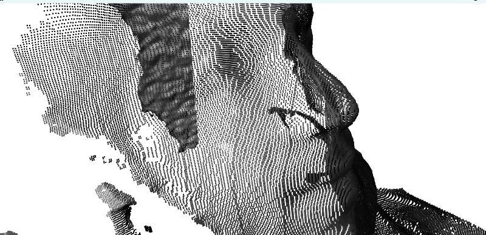

# RealSense Point Cloud Capture

Capturing and processing 3D point clouds using an Intel RealSense depth camera (D400 series). Captures aligned color and depth frames, processes them into a 3D point cloud, and saves the results for further use.

## Sample Output

### Captured Frames
| Color Frame | Depth Frame |
|-------------|-------------|
|  |  |

### Generated Point Cloud



## Features

- Real-time color and depth frame capture from Intel RealSense cameras
- Automatic alignment of depth and color frames
- Point cloud generation using Open3D
- Save captured frames and point clouds to disk
- Support for both interactive and programmatic usage

## Requirements

- Python 3.7+
- Intel RealSense D400 series camera
- Required Python packages (see `requirements.txt`)

## Installation

1. Clone this repository:
   ```bash
   git clone <https://github.com/sankar-90210/getpcdtutorial.git>
   cd getpcdtutorial
   ```

2. Install the required Python packages:
   ```bash
   pip install -r requirements.txt
   ```

## Usage

1. Connect your Intel RealSense camera to your computer.

2. Run the script:
   ```bash
   python -m src.realsensePointCloud
   ```

3. A window will appear showing the color feed from the camera.

4. Press 'q' in the window to capture the current frame and generate a point cloud.

### Output Files

The script saves the following files in the project directory:

- `data/raw/frame_color.png`: Captured color frame
- `data/raw/frame_depth.png`: Captured depth frame (grayscale)
- `data/processed/pointcloud/o3d.ply`: Generated point cloud in PLY format

### Loading and Visualizing Saved Point Clouds

You can load and visualize saved point clouds using:

```bash
python -m src.vis_pcd
```

## Project Structure

```
getpcdtutorial/
├── data/
│   ├── raw/                  # Raw captured frames
│   └── processed/            # Processed data
│       └── pointcloud/      # Generated point clouds
├── src/
│   ├── __init__.py
│   ├── realsensePointCloud.py  # Main script
│   ├── real_sense_depth.py     # Camera interface
│   └── utils.py                # Utility functions
├── docs/                       # Documentation
└── README.md
```

## Acknowledgments

- Intel RealSense SDK for providing the camera interface
- Open3D for point cloud processing and visualization